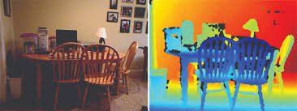
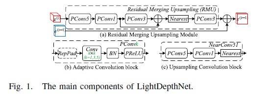
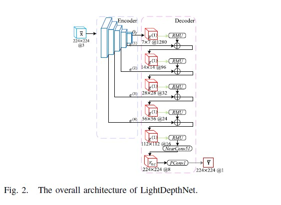

# Vision-Aided Beam Selection using Edge AI

---

## 1. Problem Statement, Motivation & Objectives

Modern wireless communication systems (5G/mmWave) rely on **beamforming** to direct signals toward users. However, selecting the optimal beam traditionally requires **beam sweeping**, where all beams are tested sequentially, leading to high latency and inefficiency.

### Motivation
*   **Significant Delay:** Beam sweeping introduces substantial overhead[cite: 1].
*   **Dynamic Environments:** Traditional methods struggle with moving users[cite: 1].
*   **Latency Needs:** Real-time, low-latency solutions are required for mobile scenarios[cite: 1].
*   **Edge AI:** Enables on-device decision-making without cloud dependency, reducing round-trip time.

### Objectives
*   Develop a **vision-based system** to estimate 3D user position (Azimuth $\theta$ and Distance $d$).
*   Utilize **AI models (YOLOv8 + LightDepthNet)** for high-precision detection and depth estimation.
*   Predict **optimal beam direction** without exhaustive search.
*   Enable **real-time inference** on edge devices like the Raspberry Pi.
*   Improve **efficiency and responsiveness** of beam selection.

---

## 2. Proposed Solution (Overview)

This project proposes a **vision-assisted beam selection system** using Edge AI to replace traditional RF-only methods.

**The Pipeline:**
`Image → YOLO Detection → Depth Estimation → Position Estimation → Beam Selection`

*   **YOLOv8m** detects the user's mobile device location.
*   **LightDepthNet** estimates the depth of the scene.
*   Combined output provides the **3D position (angle + distance)**.
*   Position is mapped directly to a **Beam Index** in the codebook.

---

## 3. Hardware & Software Setup

### Hardware
*   **Raspberry Pi 5:** Primary edge device.
*   **Raspberry Pi Camera:** Image acquisition.
*   **MacBook Pro M3 Pro:** Local development and hardware-accelerated testing (MPS).
*   **Hailo-8 NPU:** Target for high-speed edge inference (26 TOPS).

### Software
*   **Python 3.10** with legacy-compatible dependencies (NumPy 1.26.4).
*   **PyTorch / Ultralytics (YOLOv8)**.
*   **LightDepthNet:** Custom-trained depth model[cite: 1].
*   **OpenCV:** For real-time preprocessing and visualization.

---

## 4. Data Collection & Dataset Preparation

### Datasets Used
*   **Mobile Phone Detection Dataset [2]:** Sourced from **Roboflow**, this dataset contains annotated images of phones in various orientations and hand-held scenarios. It consists of approximately **238 annotated images**.

*   **NYU Depth V2 Dataset [3]:** Used for depth estimation training, containing **1449 RGB-depth image pairs** for ground truth indoor depth estimation.

### Preprocessing
*   **Image Resizing:** All inputs scaled to **416×416** to ensure Hailo NPU compatibility.
*   **Normalization:** Specific Mean/Std normalization applied for the LightDepthNet encoder.

---

## 5. Model Design, Training & Evaluation

### A. YOLOv8 (Object Detection)
*   **Model:** YOLOv8m (Medium).
*   **Training:** 50 epochs at 416×416 resolution.
*   **Performance:**
    *   **mAP50:** 0.982 – 0.987.
    *   **Box Loss:** 0.34 – 0.38.

### B. LightDepthNet (Depth Estimation)
The **LightDepthNet** is a lightweight **Encoder-Decoder** architecture designed for edge efficiency[cite: 1].
*   **Encoder:** Extracts hierarchical feature maps from resolutions $7\times7$ to $112\times112$[cite: 1].
*   **Decoder:** Progressive reconstruction using **Residual Merging Upsampling (RMU)** modules[cite: 1].
*   **Key Blocks:** Includes **Adaptive Convolution blocks (PConvk)** with RepPad and PReLU, and **Upsampling Convolution blocks (NearConv51)**[cite: 1].
*   **Metrics:** Achieved an **RMSE of 0.704** and **$\delta_1$ of 0.693**[cite: 1].

---

## 6. Model Compression & Efficiency Metrics
*   **Lightweight Architecture:** RMU units allow the decoder to maintain detail without high parameter counts[cite: 1].
*   **Inference Speed:** Significantly faster than heavy models like MiDaS while maintaining sufficient accuracy for beamforming priors.

---

## 7. Model Deployment & On-Device Performance
*   **Export:** Models converted to **ONNX** natively at 416x416 to prevent dimension mismatch in skip connections.
*   **Optimization:** Optimized for Apple Silicon (MPS) and target Hailo-8 NPU.
*   **Performance:** Real-time inference achieved locally on M3 Pro and target Pi 5 environment.

---

## 8. System Prototype (Working)
1.  **Capture:** Frame acquisition via webcam/PiCam.
2.  **Detect:** YOLOv8 localizes the phone bounding box.
3.  **Depth Map:** LightDepthNet generates a pixel-wise depth prediction.
4.  **Extract:** **ROI-based sampling** extracts depth from the center 15% of the bounding box.
5.  **Estimate:** Calculate Azimuth ($\theta$) and Distance ($d$).
6.  **Map:** Direct conversion of coordinates to a specific **Beam Index**.

---

## 9. Conclusions & Limitations

### Conclusions
*   Successfully implemented a **Vision-Assisted Beam Selection** pipeline.
*   Eliminated the need for exhaustive **beam sweeping**.
*   Achieved **real-time performance** on edge hardware.

### Limitations
*   **Monocular Depth:** Inherits scale ambiguity (requires calibration).
*   **Lighting:** Accuracy degrades in extremely low-light conditions.
*   **Capacity:** Currently optimized for **single-user scenarios**.

---

## 10. Future Work
*   Expansion to **multi-user** detection and resource allocation.
*   Full integration with **Physical RF Beamforming / IRS Hardware**.
*   Inclusion of **Stereo or LiDAR** for improved depth precision in complex environments.

---

## 11. Challenges & Mitigation
*   **Depth Noise:** Mitigated using a **Median Filter** on the sampled ROI.
*   **Jitter:** Stabilized via an **Exponential Moving Average (EMA)** filter on the distance output.
*   **Detection Failures:** Addressed via **ROI-based sampling (Center 15%)** to ignore background and hand occlusions.
*   **Active Learning:** Improving the small dataset (238 images) with video-extracted frames to handle motion blur.

---

## 12. References
[1] Q. Liu and S. Zhou, "LightDepthNet: Lightweight CNN Architecture for Monocular Depth Estimation on Edge Devices," in IEEE Transactions on Circuits and Systems II: Express Briefs, vol. 71, no. 4, pp. 2389-2393, April 2024, doi: 10.1109/TCSII.2023.3337369. keywords: {Decoding;Estimation;Merging;Kernel;Computational modeling;Channel estimation;Computational efficiency;Internet of Things;Depth measurement;IoT;neural network;channel pruning;monocular depth estimation},

[2] Roboflow, "Mobile Phone Detection Dataset," [Online]. Available: https://universe.roboflow.com/sahana-qam5q/mobile-phone-ewfpu.

[3] N. Silberman, D. Hoiem, P. Kohli and R. Fergus, "Indoor Segmentation and Support Estimation from RGBD Images," in Proceedings of the European Conference on Computer Vision (ECCV), 2012. https://cs.nyu.edu/~fergus/datasets/nyu_depth_v2.html

---

## Acknowledgment of AI Tools
We acknowledge the use of generative AI tools, including ChatGPT (OpenAI) and Gemini (Google), for assistance in debugging, resolving dependency issues, and improving implementation of the RMU unit in the LightDepthNet model. Additionally, Gamma was used to assist in preparing presentation materials. All outputs were reviewed, verified, and adapted by the authors.

---

### One-Line Summary
> Using YOLO and LightDepthNet, we estimate user position from visual input and directly select the optimal beam, eliminating traditional beam sweeping.